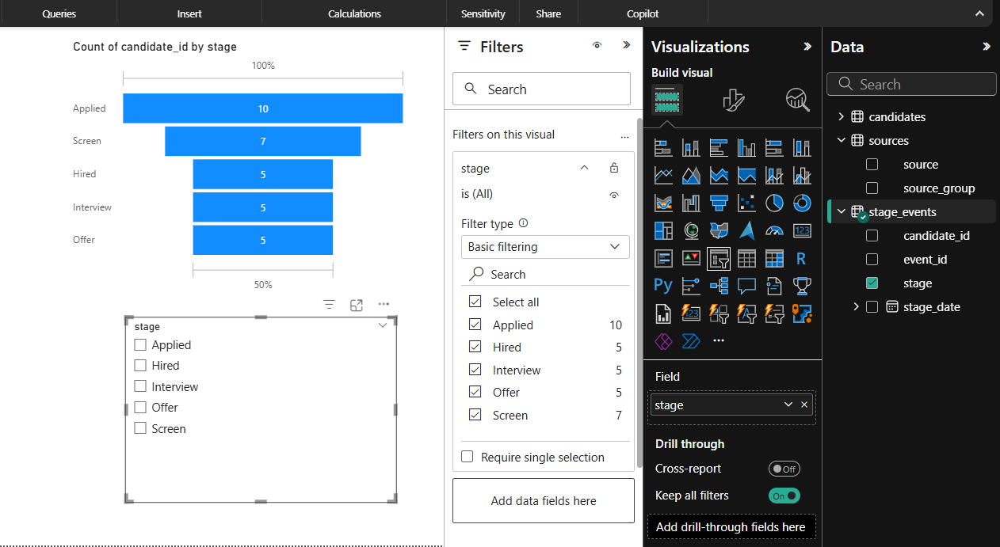
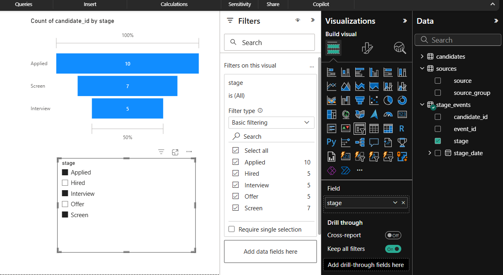
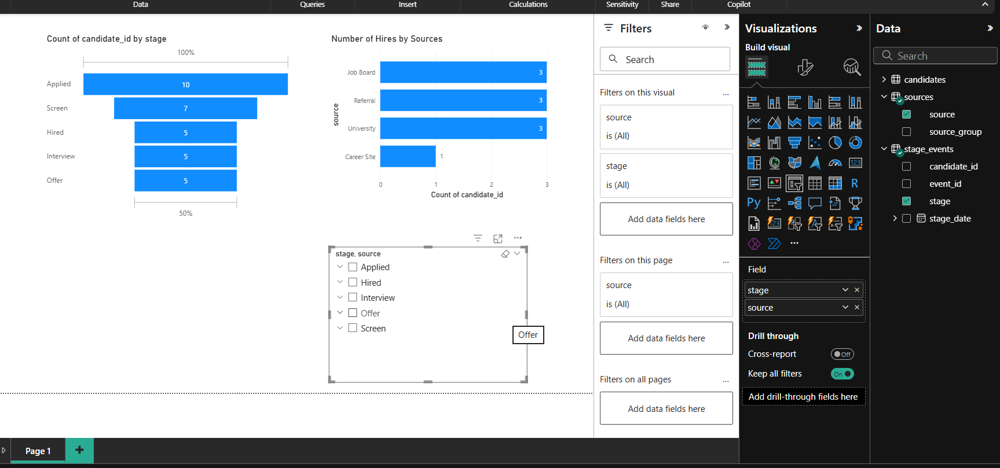
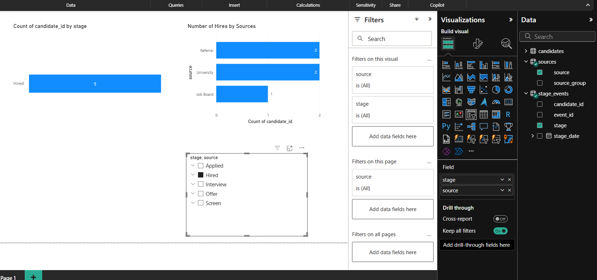

# 📊 Hiring Funnel Analytics Dashboard (Power BI)

## 🎯 Project Goal
Analyze the hiring pipeline from **Applied → Hired** and compare **hires by source** (Referral, Job Board, University, Career Site) using **Power BI**.

## 🗂️ Data
- `candidates.csv` — candidate_id, role, source, applied_date, hired_date  
- `stage_events.csv` — one row per candidate stage event (Applied/Screen/Interview/Offer/Hired + date)  
- `sources.csv` — maps `source` to `source_group`

## ⚙️ Methods
- Loaded 3 CSVs into Power BI
- Relationships:
  - `candidates.candidate_id` → `stage_events.candidate_id` (1:*)
  - `sources.source` → `candidates.source` (1:*)
- Visuals:
  - **Funnel chart:** candidate counts by stage
  - **Bar chart:** **hires** by source (filter stage = Hired)
  - **Slicer:** interactively filter by source

## 📸 Dashboard Screenshots
### Hiring Funnel

### Filtered Funnel Example

### Hires by Source

### Filtered Hires by Source

    

## 📊 Key Insights (sample)
- Clear drop-off from **Applied → Screen → Interview → Offer → Hired**
- Sources like **Referral** and **University** contribute strongly to hires

## 🚀 Next Steps
- Add date filters (month/quarter)
- Add KPIs: time-to-hire, conversion rates
- Cohort/retention view (30/60/90-day)

## 🛠️ Tools
Power BI Desktop (Modeling, DAX basics, Funnels/Bar charts, Slicers)

## 📂 Project Structure

